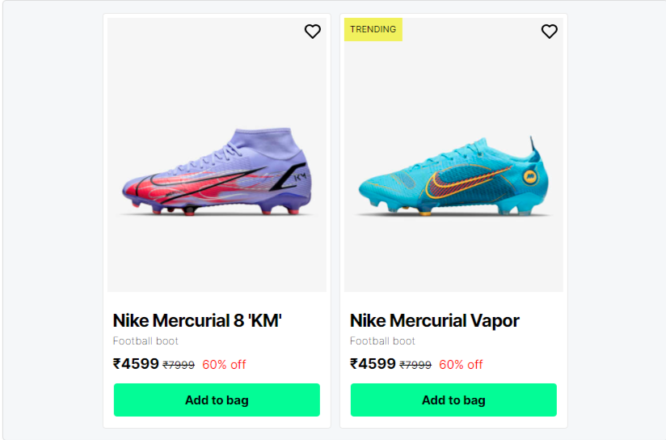

# Fezco UI - Component Library
**FEZCO** is a an open source framework which provides ready-to-use frontend components that you can swiftly
combine to build responsive web interfaces with a tint of fresh mint.
<br />


## Installation 🧩
In order to ship the framework into your project, just copy and paste the below code in the `head` tag of your `html` document
and start Fezco's minty user interfaces by directly adding class names to your html elements.

```html
<link rel="stylesheet" href="https://fezco-ui.vercel.app/core.css">
```
<br />

## Tech-stack 🍴
- HTML
- Vanilla CSS
- JavaScript

## Features 📌
The following components are delivered by the component library -
- [Alert](https://fezco-ui-6w6m6vfax-thenorthkun.vercel.app/components/alert/alert.html)
- [Avatar](https://fezco-ui.vercel.app/components/avatar/avatar.html)
- [Badge](https://fezco-ui.vercel.app/components/badge/badge.html)
- [Button](https://fezco-ui.vercel.app/components/button/button.html)
- [Card](https://fezco-ui.vercel.app/components/card/card.html)
- [Image](https://fezco-ui.vercel.app/components/image/image.html)
- [Input](https://fezco-ui.vercel.app/components/input/input.html)
- [Lists](https://fezco-ui.vercel.app/components/list/list.html)
- [Modal](https://fezco-ui.vercel.app/components/modal/modal.html)
- [Text Utilities](https://fezco-ui.vercel.app/get-started/typography/typography.html)
<br />

## Screenshots 📸

<br />
<br />

## Demo 📽️


